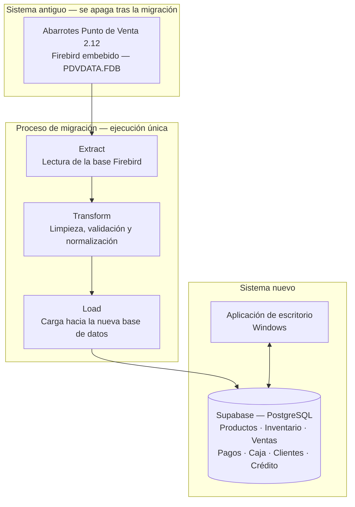

# Sistema de Punto de Venta e Inventario — Emporio NaturalSur

**Proyecto de Título · Capstone (PTY4614) · Duoc UC**

**Repositorio público:** https://github.com/vroaseitz/sistema-inventario-productos


---

## 📑 Contenido

- [1. Descripción del proyecto](#1-descripción-del-proyecto)
- [2. El sistema actual y su problemática](#2-el-sistema-actual-y-su-problemática)
- [3. Objetivos](#3-objetivos)
- [4. Alcance](#4-alcance)
- [5. Arquitectura de la solución](#5-arquitectura-de-la-solución)
- [6. Estrategia de migración](#6-estrategia-de-migración)
- [7. Tecnologías utilizadas](#7-tecnologías-utilizadas)
- [8. Instrucciones para ejecutar el proyecto localmente](#8-instrucciones-para-ejecutar-el-proyecto-localmente)
- [9. Integrantes del equipo y roles](#9-integrantes-del-equipo-y-roles)
- [10. Metodología de trabajo](#10-metodología-de-trabajo)
- [11. Plan de trabajo e hitos](#11-plan-de-trabajo-e-hitos)
- [12. Estructura del repositorio](#12-estructura-del-repositorio)
- [13. Estado actual del proyecto](#13-estado-actual-del-proyecto)
- [14. Decisiones pendientes](#14-decisiones-pendientes)
- [15. Nota para desarrollo con IA](#15-nota-para-desarrollo-con-ia)

---

## 1. Descripción del proyecto

### ¿Qué hace?

Desarrolla un **sistema de punto de venta e inventario completo** para reemplazar el software que Emporio NaturalSur utiliza actualmente en su local. El sistema cubre el ciclo operativo del negocio: gestión de productos e inventario, registro de ventas, formas de pago, cierre de caja, y administración de clientes y crédito.

El proyecto incluye además la **migración de los datos históricos** desde la base de datos del sistema antiguo hacia la nueva base de datos del sistema.

### ¿A quién va dirigido?

| Destinatario | Uso del sistema |
| --- | --- |
| **Dueñas de Emporio NaturalSur** | Administración del negocio: productos, precios, inventario, información de ventas y clientes con crédito |
| **Personal de caja** | Operación diaria: registro de ventas, cobro, formas de pago y cierre de caja |
| **Personal de bodega** | Control de existencias, ingreso de mercadería y ajustes de inventario |

### ¿Qué problema resuelve?

El local opera sobre un software descontinuado desde 2013, sin soporte, con la base de datos alojada en el mismo equipo de la caja, respaldos de solo 10 días de retención y un módulo fiscal diseñado para otro país. El sistema no permite gestionar compras ni proveedores, y su información de rentabilidad es incompleta.

El proyecto sustituye ese sistema por uno actual, respaldado en una base de datos gestionada, adaptado a la operación real del negocio y mantenible en el tiempo.

### Contexto

Emporio NaturalSur es un **minimarket de productos naturales y gourmet**. Además del local, cuenta con una página web en desarrollo, que constituye un proyecto separado con su propio repositorio.

---

## 2. El sistema actual y su problemática

### Identificación del software

| Dato | Detalle |
| --- | --- |
| **Producto** | Abarrotes Punto de Venta 2.12 |
| **Fabricante** | Bambu Code S.A. de C.V. — Chihuahua, México |
| **Copyright** | 2010 |
| **Situación del producto** | En 2013 fue renombrado a *eleventa*. La versión 2.12 quedó fuera de la línea de actualización |
| **Edición en uso** | MonoCaja |
| **Base de datos** | Firebird **embebido** (no servidor) — archivo `PDVDATA.FDB` |

### Limitaciones técnicas identificadas

| Limitación | Implicancia para el negocio |
| --- | --- |
| **Firebird embebido** | Admite una sola conexión. No es posible acceder desde otro equipo ni agregar una segunda caja |
| **Respaldo local con 10 días de retención** | El respaldo vive en el mismo PC que la base. Una falla del equipo compromete datos y respaldo a la vez |
| **Corrupción de base de datos** | El propio fabricante distribuye una herramienta de reparación, lo que indica que es un escenario recurrente |
| **Módulo fiscal CFDI mexicano** | No tiene validez tributaria en Chile |
| **Sin módulo de compras ni proveedores** | Esa funcionalidad llegó recién en la versión 4.00 (2019), fuera de la línea de este producto |
| **Calcula margen bruto, no utilidad neta** | No registra gastos, por lo que la rentabilidad real no es visible |
| **Producto descontinuado** | Sin soporte, sin actualizaciones y sin corrección de fallas |

### Problemas en la información de productos

* Errores en la información de productos.
* Productos faltantes y productos duplicados.
* Productos sin imágenes y sin descripción.
* Precios incorrectos o vacíos.
* Información inconsistente entre registros.
* Dificultades para mantener actualizados los productos.
* Limitaciones en la administración de productos.
* Dificultades para gestionar productos vendidos por unidad frente a productos vendidos a granel.

---

## 3. Objetivos

### Objetivo general

Desarrollar e implantar un sistema de punto de venta e inventario para Emporio NaturalSur que reemplace el software actualmente en uso, cubriendo la gestión de productos, el control de inventario, el registro de ventas, las formas de pago, el cierre de caja y la administración de clientes y crédito, incluyendo la migración de la información histórica desde el sistema antiguo.

### Objetivos específicos

1. **Diagnosticar** el sistema actual, su base de datos y sus limitaciones, documentando los hallazgos que justifican el reemplazo.
2. **Levantar los requerimientos** funcionales y no funcionales de la operación del negocio, expresados como historias de usuario priorizadas.
3. **Diseñar la arquitectura** de la solución y el **modelo de datos** que soporte productos, inventario, ventas, pagos, caja, clientes y crédito.
4. **Desarrollar el módulo de productos e inventario**, incluyendo productos vendidos por unidad y a granel.
5. **Desarrollar el módulo de ventas**, con formas de pago y cierre de caja.
6. **Desarrollar el módulo de clientes y crédito**.
7. **Diseñar y ensayar el proceso de migración** de datos desde la base Firebird hacia la nueva base de datos, con su plan de reversa.
8. **Verificar el sistema** mediante pruebas unitarias, de integración, de rendimiento y de seguridad.
9. **Elaborar la documentación técnica y el manual de despliegue** que permitan instalar, operar y mantener el sistema.

---

## 4. Alcance

### Incluido

El proyecto desarrolla una **aplicación completa**, no un módulo aislado.

| Área | Contenido |
| --- | --- |
| **Productos** | Códigos, nombres, descripciones, marcas, categorías y subcategorías, unidades de venta, imágenes, estados |
| **Inventario** | Control de existencias, ajustes, productos por unidad y productos a granel |
| **Ventas** | Registro de la venta, búsqueda de productos, cálculo de totales |
| **Formas de pago** | Registro de los medios de pago utilizados en cada venta |
| **Cierre de caja** | Apertura, movimientos y cierre del turno |
| **Clientes y crédito** | Registro de clientes y administración de sus créditos |
| **Calidad de datos** | Validación, detección de duplicados, depuración y normalización de la información |
| **Migración** | Extracción desde Firebird, transformación y carga hacia la nueva base de datos |
| **Pruebas** | Unitarias, de integración, de rendimiento y de seguridad |
| **Documentación** | Diagnóstico, requerimientos, diseño, modelo de datos, diagramas, manual técnico de despliegue |

### Fuera del alcance

| Excluido | Motivo |
| --- | --- |
| Integración con balanza electrónica | La balanza del local no tiene puerto de comunicación (ver sección de hardware) |
| Facturación electrónica ante el SII | No forma parte de los objetivos del proyecto |
| Medios de pago en línea | El sistema registra la forma de pago, no procesa transacciones |
| Módulo contable y de remuneraciones | Fuera del ámbito del punto de venta |
| Desarrollo de una página web nueva | La web es un proyecto separado, con su propio repositorio |
| Automatizaciones avanzadas de mensajería | No aporta a los objetivos definidos |
| Inteligencia artificial y sistemas de recomendación | No aporta a los objetivos definidos |

### Hardware: balanza del local

La balanza en uso es una **MANA de 40 kg, con graduación de 5 g**, y **no cuenta con puerto de comunicación**, por lo que no puede integrarse al sistema.

**Decisión de diseño:** el módulo de productos soporta **productos pesables desde el inicio** (venta a granel, precio por kilo) y contempla un **parser de códigos de barras con peso embebido** (prefijos 20–29), de modo que el sistema quede preparado si la tienda adquiere una balanza etiquetadora. Mientras tanto, el peso se ingresa manualmente.

---

## 5. Arquitectura de la solución

La solución es una **aplicación de escritorio sobre Windows** que opera contra una **base de datos gestionada en Supabase (PostgreSQL)**. La migración desde el sistema antiguo es un proceso independiente que se ejecuta una sola vez.



### Componentes

| Componente | Responsabilidad |
| --- | --- |
| **Aplicación de escritorio** | Interfaz de operación: ventas, caja, inventario, productos, clientes y crédito. Se ejecuta en el equipo del local, sobre Windows |
| **Base de datos gestionada** | Supabase (PostgreSQL). Almacena toda la información del negocio y es la única fuente de verdad del sistema nuevo |
| **Proceso de migración** | Componente independiente que lee la base Firebird del sistema antiguo, transforma la información y la carga en la nueva base. Se ejecuta una vez, en el corte |

### Comunicación

La aplicación de escritorio se comunica con Supabase a través de su API sobre HTTPS. El proceso de migración lee el archivo `PDVDATA.FDB` de forma local y escribe hacia Supabase.

> El diagrama de componentes y los diagramas UML detallados se encuentran en `docs/07-diagramas-uml/`. El modelo de datos entidad-relación está en `docs/06-modelo-datos/`.

### Nota sobre portabilidad y contenedores

La solución **no utiliza contenedores**: se trata de una aplicación de escritorio que se instala en el equipo del local, combinada con una base de datos gestionada por un tercero. No hay componentes ejecutándose como servicio propio. Esta situación fue expuesta a la profesora guía el **21 de agosto de 2026** y se autorizó la excepción, con el compromiso de cumplir mecanismos equivalentes:

| Mecanismo equivalente | Ubicación |
| --- | --- |
| Manual técnico de despliegue | `docs/12-despliegue/` |
| Instalador empaquetado | Entregable del proyecto |
| Variables de entorno separadas del código | `config/.env.example` |
| Portabilidad como requisito no funcional | `docs/04-requisitos-no-funcionales/` |
| Justificación técnica de la excepción | `docs/08-diseno/` |

---

## 6. Estrategia de migración

La migración es un **evento único**, no una sincronización permanente. Se descartó la convivencia entre ambos sistemas.

```text
1. Respaldo íntegro de la base Firebird del sistema antiguo
2. Ensayos de migración repetidos en máquina virtual
3. Corte: migración real de los datos
4. Entrada en operación del sistema nuevo
5. Apagado del sistema antiguo
```

| Aspecto | Definición |
| --- | --- |
| **Tipo** | Evento único en el corte de sistema |
| **Plan de reversa** | El respaldo previo se conserva intacto. Si algo falla en los primeros días, se reinstala el sistema antiguo |
| **Ensayos** | La migración se ensaya varias veces en máquina virtual antes del corte real. Cada ensayo queda registrado como evidencia del proyecto |

### Tipos de migración documentados

| Tipo | Descripción | Dónde se registra |
| --- | --- | --- |
| **Migración de datos** | Traspaso único de la información histórica desde Firebird | `docs/09-plan-migracion/` |
| **Migraciones de esquema** | Cambios en la estructura de la base durante el desarrollo, versionados | `database/migraciones/` |
| **Migraciones correctivas** | Ajustes posteriores al arranque, si se detectan inconsistencias | `database/migraciones/` |

---

## 7. Tecnologías utilizadas

### Base de datos

| Tecnología | Uso |
| --- | --- |
| **Supabase** | Plataforma de base de datos gestionada del sistema nuevo |
| **PostgreSQL** | Motor sobre el que opera Supabase |

### Sistema de origen

| Tecnología | Uso |
| --- | --- |
| **Firebird (embebido)** | Motor de la base de datos del sistema antiguo. Origen de los datos de la migración. Archivo `PDVDATA.FDB` |

### Plataforma de ejecución

| Elemento | Definición |
| --- | --- |
| **Sistema operativo** | Windows — es el entorno del equipo del local |
| **Formato de entrega** | Instalador empaquetado |

### Herramientas de desarrollo y gestión

| Herramienta | Uso |
| --- | --- |
| **Git** | Control de versiones |
| **GitHub** | Repositorio remoto y evidencia del avance del proyecto |
| **ClickUp** | Gestión ágil: sprints, backlog, decisiones y documentación |
| **Cursor** | Entorno de desarrollo |
| **Máquina virtual** | Ensayos del proceso de migración |

### Pendiente de definición

| Definición | Restricciones que debe cumplir |
| --- | --- |
| **Stack de la aplicación de escritorio** | Ejecutarse en Windows · conectarse a Supabase · ser empaquetable como instalador |
| **Framework de pruebas** | Compatible con el stack que se elija |
| **Operación sin conexión a internet** | Ver sección de decisiones pendientes |

> Las decisiones técnicas deben justificarse por los requerimientos del proyecto y no únicamente por factibilidad o preferencia tecnológica. La justificación de cada decisión se documenta en `docs/08-diseno/`.

---

## 8. Instrucciones para ejecutar el proyecto localmente

> **Estado:** el proyecto está en Fase 1 (definición). Esta sección se completa con los comandos concretos una vez definido el stack de la aplicación.

### Requisitos previos

| Requisito | Detalle |
| --- | --- |
| **Windows** | Sistema operativo objetivo de la aplicación |
| **Git** | Para clonar el repositorio — https://git-scm.com |
| **Proyecto en Supabase** | URL y llaves del proyecto utilizado como base de datos |
| **Archivo `PDVDATA.FDB`** | Solo para ejecutar el proceso de migración. Copia del respaldo, nunca la base en producción del local |
| **Entorno de ejecución** | Por definir junto con el stack de la aplicación |

### 1. Clonar el repositorio

```bash
git clone https://github.com/vroaseitz/sistema-inventario-productos.git
cd sistema-inventario-productos
```

### 2. Configurar las variables de entorno

El repositorio incluye una plantilla **sin credenciales reales**:

```bash
cp config/.env.example .env
```

Abre el archivo `.env` y completa los valores de tu entorno.

> ⚠️ El archivo `.env` está excluido por `.gitignore` y **nunca debe subirse al repositorio**.

### 3. Instalar dependencias

Pendiente. Se documenta al definir el stack.

### 4. Ejecutar la aplicación

Pendiente. Se documenta al definir el stack.

### 5. Ejecutar el proceso de migración

Pendiente. Se documenta al implementar el proceso. El manual completo de despliegue y migración vive en `docs/12-despliegue/`.

### 6. Ejecutar las pruebas

Pendiente. Se documenta al definir el framework de pruebas.

---

## 9. Integrantes del equipo y roles

| Integrante | Usuario GitHub | Rol | Responsabilidades |
| --- | --- | --- | --- |
| **Victoria Roa Seitz** | [`@vroaseitz`](https://github.com/vroaseitz) | Análisis y documentación | Levantamiento de requerimientos, diagnóstico del sistema actual, documentación del proyecto, actas, informes de avance e informe final. Coordinación de entregas y del tablero en ClickUp |
| **Eduardo Andrés Guzmán Manquehual** | [`@eg-andreszx`](https://github.com/eg-andreszx) | Desarrollo y documentación | Apoyo transversal: participa en el desarrollo del sistema y en la elaboración de la documentación. Nexo entre el diseño documentado y la implementación |
| **Fernando Silva** | [`@fernandosilvot`](https://github.com/fernandosilvot) | Desarrollo | Desarrollo de la aplicación, modelo de datos, proceso de migración e integración de componentes |

Los roles indican el **foco principal** de cada integrante. El equipo acordó que **todos participan y revisan todas las áreas**, de modo que ningún avance dependa de una sola persona y los tres puedan explicar y defender cualquier parte del proyecto. La distribución de tareas por sprint se registra en ClickUp y en las actas (`docs/actas/`).

### Contexto académico

| | |
| --- | --- |
| **Institución** | Duoc UC |
| **Carrera** | Ingeniería en Informática |
| **Asignatura** | Capstone — sigla **PTY4614** |
| **Nivel** | 8.º semestre |
| **Sección** | 005D |
| **Período** | Segundo semestre 2026 |
| **Profesora guía** | Karla Marilyn Roco |
| **Contraparte** | Emporio NaturalSur |

---

## 10. Metodología de trabajo

El equipo trabaja con una **metodología ágil**, en **sprints de 2 semanas**.

### Gestión: ClickUp

La planificación y el seguimiento se gestionan en un **workspace propio de Duoc en ClickUp**, separado del workspace de la práctica.

| Estructura en ClickUp | Contenido |
| --- | --- |
| **Folder: Sprints** | Un espacio por sprint, con las tareas comprometidas |
| **Lista: Backlog de producto** | Historias de usuario priorizadas, pendientes de asignar a un sprint |
| **Lista: Decisiones pendientes** | Definiciones técnicas y de alcance aún por resolver |
| **Lista: Preguntas para las dueñas** | Consultas acumuladas para las reuniones con la contraparte |
| **Lista: Documentación Duoc** | Entregas y evidencias exigidas por la asignatura |

### Ceremonias

| Ceremonia | Frecuencia | Propósito |
| --- | --- | --- |
| **Planificación de sprint** | Cada 2 semanas | Definir el compromiso del sprint a partir del backlog priorizado |
| **Seguimiento** | Semanal | Revisar avances y levantar impedimentos |
| **Revisión de sprint** | Al cierre de cada sprint | Mostrar el incremento logrado |
| **Retrospectiva** | Al cierre de cada sprint | Identificar mejoras. Queda registrada en `docs/10-sprints/` |
| **Validación con la contraparte** | Según disponibilidad | Confirmar que lo construido responde a la operación real del negocio |

### Artefactos del marco ágil

| Artefacto | Ubicación en el repositorio |
| --- | --- |
| Product Vision | `docs/02-vision-producto/` |
| Product Backlog priorizado con historias de usuario | `docs/03-backlog/` |
| Definition of Done | `docs/03-backlog/` |
| Sprint Backlog por sprint | `docs/10-sprints/` |
| Evidencia de retrospectivas | `docs/10-sprints/` |
| Documento de diseño | `docs/08-diseno/` |
| Plan de pruebas por sprint | `docs/11-pruebas/` |
| Manual técnico de despliegue | `docs/12-despliegue/` |

### Trazabilidad

```text
Problema → Requerimiento → Diseño → Implementación → Prueba → Resultado
```

Cada funcionalidad debe poder rastrearse hasta el problema que resuelve. No se incorporan elementos que no aporten directamente a los objetivos del proyecto.

### Flujo de trabajo en Git

```text
main          ← rama estable; solo recibe cambios revisados
 └── develop  ← rama de integración del equipo
      ├── feature/<nombre-funcionalidad>
      ├── fix/<nombre-correccion>
      └── docs/<nombre-documento>
```

**Reglas acordadas:**

1. No se hace *commit* directo sobre `main`.
2. Toda incorporación a `main` se realiza mediante *Pull Request* con al menos una revisión de otro integrante.
3. Mensajes de commit según [Conventional Commits](https://www.conventionalcommits.org/): `feat:`, `fix:`, `docs:`, `test:`, `refactor:`, `chore:`.
4. **Cada integrante realiza sus propios commits.** El repositorio es la evidencia del aporte individual de cada uno.
5. **No se suben credenciales al repositorio**: ni llaves de Supabase, ni datos de conexión, ni la base de datos del local.

---

## 11. Plan de trabajo e hitos

| Hito | Cuándo | Entregable |
| --- | --- | --- |
| **Evaluación formativa Fase 1** | Semana 2 · 0% | Definición del Proyecto APT — retroalimentación |
| **Evaluación sumativa Fase 1** | Semana 4 · **20%** | Informe de Definición del Proyecto APT + presentación de 15 minutos |
| **Diseño y modelo de datos** | Durante los primeros sprints | Documento de diseño, arquitectura, modelo ER y diagramas UML |
| **Desarrollo por sprints** | Sprints de 2 semanas | Incrementos funcionales: productos e inventario, ventas y caja, clientes y crédito |
| **Ensayos de migración** | Previo al corte | Registro de cada ensayo en máquina virtual |
| **Sistema completo y demostrable** | **Semana 14 — segunda semana de noviembre 2026** | Sistema funcionando para la presentación. Se grabará un video del sistema en operación como respaldo |
| **Extracción final del repositorio** | Semana 18 | El repositorio debe permanecer público y activo hasta esta fecha |

> No es obligatorio haber realizado la migración en el local para la semana 14, pero sí contar con el sistema completo y demostrable.

---

## 12. Estructura del repositorio

```text
sistema-inventario-productos/
│
├── Evidencias Individuales/         Evidencias individuales de la asignatura
│   └── Fase 1/
│
├── Evidencias Grupales/             Evidencias grupales de la asignatura
│   └── Fase 1/
│
├── docs/                            Documentación del proyecto
│   ├── 01-diagnostico/              Diagnóstico del sistema actual
│   ├── 02-vision-producto/          Product Vision y documento de inicio
│   ├── 03-backlog/                  Product Backlog, historias de usuario, Definition of Done
│   ├── 04-requisitos-no-funcionales/  Seguridad, rendimiento, disponibilidad, portabilidad
│   ├── 05-arquitectura/             Diagrama de arquitectura y componentes
│   ├── 06-modelo-datos/             Modelo entidad-relación y diccionario de datos
│   ├── 07-diagramas-uml/            Casos de uso, clases, secuencia, componentes
│   ├── 08-diseno/                   Documento de diseño y justificación de decisiones técnicas
│   ├── 09-plan-migracion/           Estrategia de migración, ensayos y plan de reversa
│   ├── 10-sprints/                  Sprint Backlog y retrospectivas
│   ├── 11-pruebas/                  Planes y resultados de pruebas por sprint
│   ├── 12-despliegue/               Manual técnico de despliegue e instalación
│   ├── 13-innovacion/               Sección de innovación del proyecto
│   ├── actas/                       Actas de reunión
│   └── informes/                    Informes de avance e informe final
│
├── src/                             Código fuente
│   ├── app/                         Aplicación de escritorio
│   ├── migracion/                   Proceso de migración desde Firebird
│   └── shared/                      Código compartido
│
├── database/                        Capa de datos
│   ├── modelo/                      Definición del esquema
│   ├── migraciones/                 Migraciones de esquema versionadas
│   └── scripts/                     Consultas de apoyo y depuración
│
├── tests/                           Pruebas
│   ├── unitarias/
│   ├── integracion/
│   ├── rendimiento/
│   └── seguridad/
│
├── scripts/                         Utilidades de apoyo
├── assets/                          Recursos gráficos
├── config/                          Plantillas de configuración (sin credenciales)
├── .gitignore
└── README.md
```

---

## 13. Estado actual del proyecto

**Fase 1 — Definición del Proyecto APT.**

### Resuelto

- ✅ Identificación del software actual: Abarrotes Punto de Venta 2.12 de Bambu Code, con Firebird embebido.
- ✅ Diagnóstico de sus limitaciones técnicas y funcionales.
- ✅ Definición del alcance: punto de venta completo, no solo gestión de productos.
- ✅ Estrategia de migración: evento único con plan de reversa, ensayada en máquina virtual.
- ✅ Excepción de contenedores autorizada por la profesora guía, con mecanismos equivalentes comprometidos.
- ✅ Decisión sobre la balanza: productos pesables soportados desde el inicio, integración descartada.
- ✅ Metodología y herramienta de gestión: ágil con sprints de 2 semanas en ClickUp.
- ✅ Repositorio público con estructura definida.

### En curso

- 🟡 Levantamiento de requerimientos con la contraparte.
- 🟡 Definición del stack tecnológico de la aplicación de escritorio.
- 🟡 Elaboración del informe de Definición del Proyecto APT.

---

## 14. Decisiones pendientes

| Decisión | Restricciones y consideraciones | Prioridad |
| --- | --- | --- |
| **Stack de la aplicación de escritorio** | Windows · conexión a Supabase · empaquetable como instalador | **Alta** |
| **Operación sin conexión a internet** | Si hoy se cae la conexión, no se podría vender. Frente al sistema local actual esto es una regresión, y necesita una respuesta de diseño | **Alta** |
| **Framework de pruebas** | Compatible con el stack elegido | Media |

Estas decisiones se registran en la lista *Decisiones pendientes* de ClickUp y su resolución se documenta en `docs/08-diseno/`.

---

## 15. Nota para desarrollo con IA

Este repositorio corresponde a un **Proyecto de Título académico**.

Antes de implementar nuevas funcionalidades:

1. Identificar el problema que se busca solucionar.
2. Verificar si existe un requerimiento asociado en el backlog.
3. Evaluar si la funcionalidad pertenece al alcance.
4. Analizar el impacto en la arquitectura y en la base de datos.
5. Definir cómo será probada.
6. Documentar los cambios realizados.

No implementar funcionalidades únicamente porque sean técnicamente posibles o visualmente atractivas.

La prioridad es **resolver los problemas reales de la operación de Emporio NaturalSur**.
