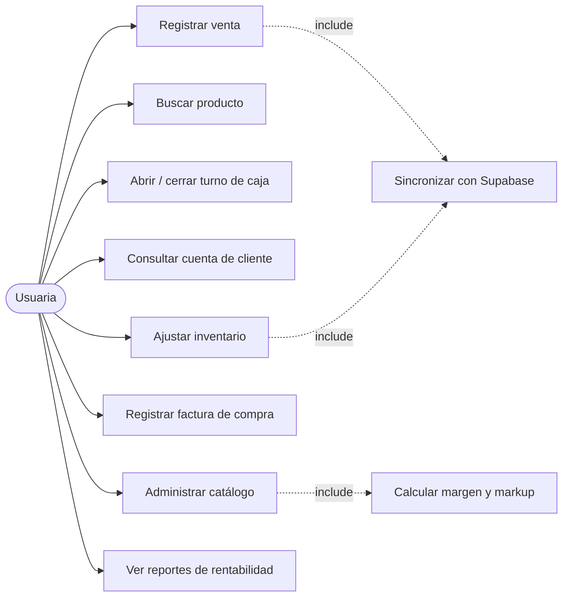
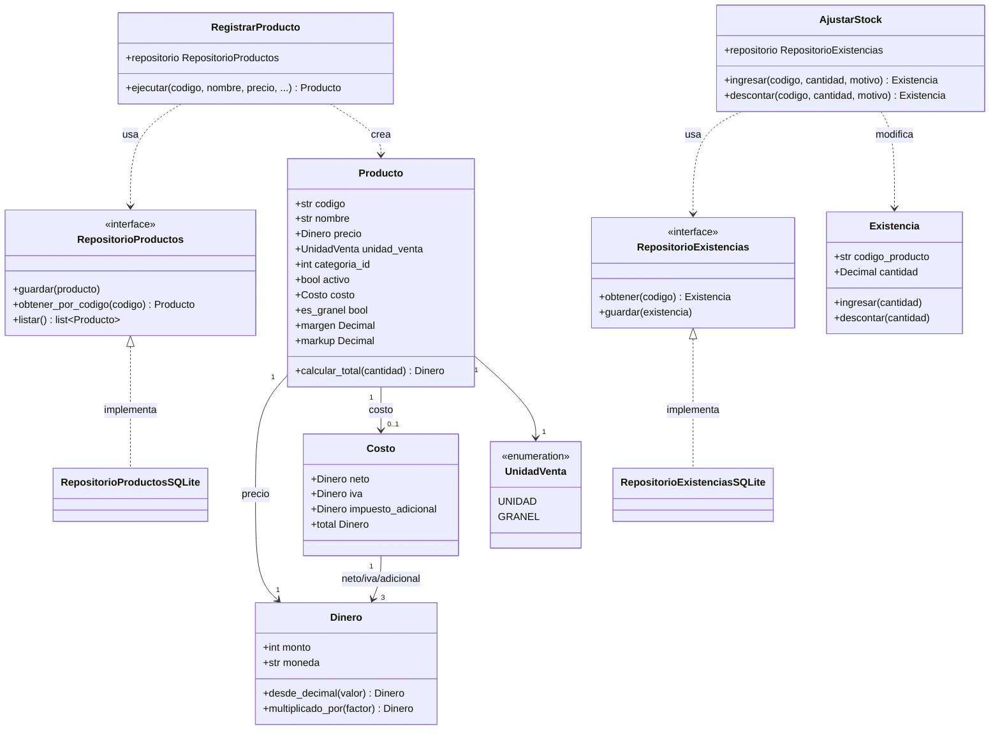
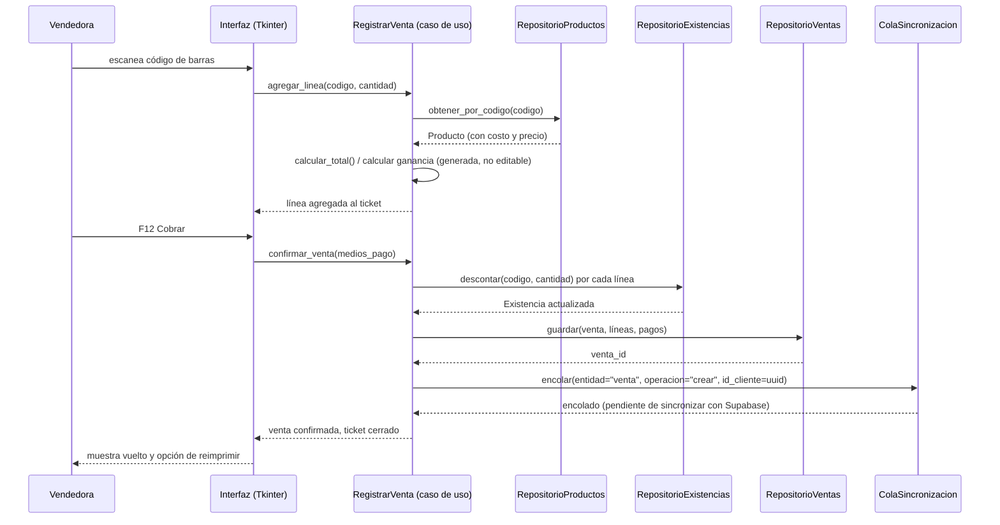
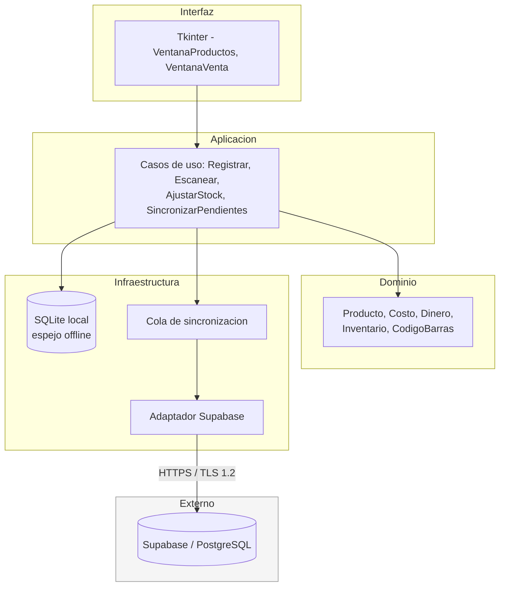

# 07 · Diagramas UML

Diagramas mínimos exigidos por el instructivo.

| Diagrama | Estado |
| --- | --- |
| Casos de uso | ✅ |
| Clases | ✅ |
| Secuencia de la funcionalidad principal | ✅ |
| Componentes | ✅ |

> **Responde al instructivo:** diagramas UML mínimos (obligatorio transversal).
>
> La funcionalidad principal para el diagrama de secuencia es el **registro de una venta**.

## 1. Casos de uso

**Perfil único** (HU-USR-01/03 del Product Backlog, decisión de alcance del
16-09-2026): se elimina la distinción Administradora/Vendedora. Cualquier
usuaria autenticada accede a todos los casos de uso; el control de acceso por
rol queda como incremento posterior, sin tarea ni fecha todavía. El
`prototipo-naturalsur-pantalla-completa.html` (`docs/08-diseno/`) sigue
mostrando el selector de perfil porque es anterior a esta decisión — no
representa el alcance actual.

## 2. Clases

Refleja el código real de `src/pos/dominio/` (no un diseño aspiracional —
arquitectura por capas, ver ADR 0001).

`Producto.categoria_id` referencia la tabla `categoria` del modelo ER (§06) en vez
de guardar el nombre como texto: renombrar o fusionar categorías (HU-PRD-10) solo
debe tocar una fila de esa tabla, no reescribir cada producto que la usa.
`AjustarStock.ingresar/descontar` exigen `motivo` (HU-INV-04) — es la corrección de
los 29.715 ajustes de inventario sin causa del sistema legado.

## 3. Secuencia — Registro de una venta

Funcionalidad principal (HU-VTA-01/02). Ilustra el flujo objetivo una vez
construido el módulo de ventas sobre los casos de uso y repositorios ya existentes;
`RegistrarVenta` y `RepositorioVentas` son el trabajo de Sprint 4.

## 4. Componentes

